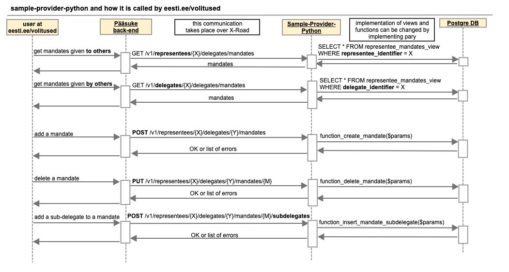

# Adapter application (Python)

This application is an adapter for Pääsuke written in Python Flask.
This is used by a party who keeps mandates on their side but offers a standard service
for Pääsuke for it to query mandates.

The idea is that there is a Postgres database that keeps the data.
Into that Postgres database we create view and procedures that this app calls.

## Sequence diagram illustrating the application



## How this application differs from mocks

There is an application that mimics the different parties:
https://github.com/e-gov/PH/tree/main/ph-xroad-api-mock
The mock does not keep state. This application does.

## Prerequisite

Use Docker-compose to start up a Postgres database.
This database has a few tables to sore information about mandates.


## How this app was made

1. Open https://app.swaggerhub.com/apis/aasaru/x-road-services-consumed-by-paasuke/0.8.0#/
2. Export server stub -> python flask


## Configuration
1. List of roles => view


## How to run API app in development environment

    `python3 -m venv venv`
    `source venv/bin/activate`
    `pip install -r requirements.txt`
    `export PYTHONPATH=$PWD`

Check configuration example in example.cfg.

    `cp config/example.cfg config/dev.cfg`

    `export APP_SETTINGS=../config/dev.cfg`

    `python3 api/app.py`

## How to run API app with docker-compose
    `docker-compose up -d`

Access API on http://localhost:5002/v1

```
curl --location 'http://localhost:5002/v1/representees/EE33333333/delegates/mandates' \
--header 'X-Road-UserId: test-header-xroad-userid' \
--header 'X-Road-Represented-Party: TEST-Represented-Party' \
--header 'X-Road-Id: TEST-ID-12345'
```

## Tests

Tests are using the Postgres database running on a Docker container and fixture data inside.
    `python3 -m venv venv`
    `source venv/bin/activate`
    `pip install -r requirements.txt`
    `export PYTHONPATH=$PWD`
    `export APP_SETTINGS=../config/test.cfg`
    `pytest`

## How to run API app using WSGI and gunicorn

    `pip install gunicorn`

Point gunicorn to WSGI entrypoint `wsgi.py`

    `gunicorn --bind 127.0.0.1:5001 wsgi:application`


## Endpoints

### `GET /v1/representees/<str:representee>/delegates/mandates`

Accepts representee identifier as parameter in path
Raises `400` error if identifier does not validate
Returns the list of `MandateTriplet`s with status code `200` if representee has valid mandates
Returns empty list if the representee has no valid mandates or the representee is unknown.
Uses Postgres view `representee_mandates_view`

Example:
```
curl --location 'http://localhost:5002/v1/representees/EE33333333/delegates/mandates' \
--header 'X-Road-UserId: test-header-xroad-userid' \
--header 'X-Road-Represented-Party: test-header-xroad-represented-party' \
--header 'X-Road-Id: test-header-xroad-id'
```


### `GET /v1/delegates/<str:delegate>/representees/mandates`

Accepts delegate identifier as parameter in path
Raises `400` error if identifier does not validate
Returns the list of `MandateTriplet`s with status code `200` if delegate has valid mandates
Returns an empty list if delegate has no valid mandates or the delegate is unknown.
Uses Postgres view `representee_mandates_view`

Example:
```
curl --location 'http://127.0.0.1:5002/v1/delegates/EE1111111/representees/mandates' \
--header 'X-Road-UserId: Test User Id'
```

### `GET /roles`

Get a list of roles
Selects data from Postgres view `roles_view`

Example:

`curl --location 'http://localhost:5002/v1/roles`


### `POST /v1/representees/<str:representee>/delegates/<str:delegate>/mandates`

Accepts repreentee and delegate identifiers as path parameters
Raises `400` error if payload data is not valid or identifiers are not valid
Raises `422` error if Postgres function `function_create_mandate` does not validate input data.
Return an empty list with status code `201` in case of success

Example of successful request:

```
curl --location 'http://127.0.0.1:5002/v1/representees/EE12345678/delegates/EE38302250123/mandates' \
--header 'Content-Type: application/json' \
--header 'X-Road-UserId: LT123456' \
--header 'X-Road-Represented-Party: LV1234566' \
--data '  {
  "authorizations": [
    {
      "hasRole": "FROM_BUSINESS_REGISTRY:MANAGEMENT_BOARD_MEMBER_FULL",
      "userIdentifier": "EE49028099999"
    }
  ],
  "delegate": {
    "firstName": "Jüri",
    "identifier": "EE38302250123",
    "surname": "Juurikas",
    "type": "NATURAL_PERSON"
  },
  "document": {
    "singleDelegate": true,
    "uuid": "5b72e01c-fa7f-479c-b014-cc19efe5b732"
  },
  "mandate": {
    "canSubDelegate": true,
    "role": "GLOBAL1_EMTA:ACCOUNTANT",
    "validityPeriod": {
      "from": "2028-01-01",
      "through": "2030-12-31"
    }
  },
  "representee": {
    "identifier": "EE12345678",
    "legalName": "Väikefirma OÜ",
    "type": "LEGAL_PERSON"
  }
}'
```


### `POST /v1/representees/<representeeId>/delegates/<delegateId>/mandates/<mandateId>/subdelegates`

Accepts `representeeId`, `delegateId`, `mandateId` as parameters in the path.
Raises `404` error if the mandate does not exist
Raises `422` error if Postgres function `function_insert_mandate_subdelegate` does not validate input data.
Returns empty list with status code `200` in success case

Example of successful request:
```
curl --location 'http://127.0.0.1:5002/v1/representees/EE33333333/delegates/100001/mandates/150003/subdelegates' \
--header 'Content-Type: application/json' \
--header 'X-Road-UserId: EE23232323' \
--header 'X-Road-Represented-Party: EE2323224444' \
--data '{
  "authorizations": [
    {
      "hasRole": "FROM_BUSINESS_REGISTRY:MANAGEMENT_BOARD_MEMBER_FULL",
      "userIdentifier": "EE39912310123"
    }
  ],
  "document": {
    "singleDelegate": true,
    "uuid": "5b72e01c-fa7f-479c-b014-cc19efe5b732"
  },
  "subDelegate": {
    "firstName": "Jüri",
    "identifier": "EE38302250123",
    "surname": "Juurikas",
    "type": "NATURAL_PERSON"
  },
  "validityPeriod": {
    "from": "2028-01-01",
    "through": "2030-12-31"
  }
}'
```


### `PUT /v1/representees/<representeeId>/delegates/<delegateId>/mandates/<mandateId>`

Accepts `representeeId`, `delegateId`, `mandateId` as parameters in the path.
Raises `404` error if the mandate does not exist
Raises `422` error if Postgres function `function_delete_mandate` does not validate input data.
Returns empty list with status code `200` in success case

Example of successful request:

```
curl --location --request PUT 'http://127.0.0.1:5002/v1/representees/EE33333333/delegates/100001/mandates/150003' \
--header 'Content-Type: application/json' \
--data '{
  "action": "DELETE",
  "authorizations": [
    {
      "userIdentifier": "EE39912310123",
      "hasRole": "BR_REPRIGHT:SOLEREP"
    }
  ],
  "document": {
    "uuid": "5b72e01c-fa7f-479c-b014-cc19efe5b732",
    "singleDelegate": true
  }
}'


```


